  

  
  
  <h1>
     
    Hey, I'm Lesley Ngcobo
  </h1>
  
  

    <strong>🧠 Data Scientist • 🤖 ML Specialist • 📊 Insight Architect</strong> 
    <em>Transforming complex data into actionable intelligence</em>
  

  
  

    
    
    
    
  

  
  

---

  

## 🚀 About Me

<table>
  <tr>
    <td>
      
    </td>
    <td>
      
**🎓 Academic Foundation:** Information Technology @ Nelson Mandela University  
**🔬 Core Expertise:** Machine Learning, Statistical Analysis & Data Storytelling  
**💡 Philosophy:** *"The best models aren't just accurate - they're understood"*  
**🎯 Mission:** Building interpretable AI systems that drive real business value  
**🌟 Passion:** Turning complex datasets into compelling insights and actionable solutions  

**🔗 Portfolio:** [**lesleyngcobo.netlify.app**](https://lesleyngcobo.netlify.app) - *Explore my complete project showcase*

</td>
  </tr>
</table>

---

## 💼 Featured Projects

| 🎯 **DataQuest Recommender** | 🛡️ **Fraud Detection System** | 🏠 **PropertyQuest Platform** | 📊 **Portfolio Website** |
|:---:|:---:|:---:|:---:|
|  |  |  |  |
| **Hybrid ML Recommender** | **Advanced Fraud Detection** | **Real Estate Search Platform** | **Client Portfolio Site** |
| Collaborative filtering + content-based algorithms for personalized recommendations | Imbalanced classification with ensemble learning and real-time monitoring | Angular & ASP.NET platform with smart search algorithms | Modern responsive design with SEO optimization |
| `R` `recommenderlab` `Machine Learning` | `R` `Power BI` `XGBoost` `SMOTE` | `Angular` `ASP.NET` `Web Development` | `HTML5` `CSS3` `JavaScript` |
| [**View Project →**](https://github.com/lesley-2198/DataquestRcSys2025.git) | [**View Project →**](https://github.com/lesley-2198/CreditCardFraudDetection.git) | [**View Project →**](https://github.com/lesley-2198/PropertyQuest.git) | [**View Live →**](https://bongiwe.netlify.app) |

---

## 🛠️ Technical Arsenal

### 🐍 **Core Data Science Stack**
<table>
  <tr>
    <td align="center" width="120">
       
      <b>R & RStudio</b>
    </td>
    <td align="center" width="120">
       
      <b>Python</b>
    </td>
    <td align="center" width="120">
       
      <b>Tidyverse</b>
    </td>
    <td align="center" width="120">
       
      <b>ggplot2</b>
    </td>
    <td align="center" width="120">
       
      <b>recommenderlab</b>
    </td>
  </tr>
</table>

### 📊 **Data & Analytics Platforms**
<table>
  <tr>
    <td align="center" width="120">
       
      <b>Power BI</b>
    </td>
    <td align="center" width="120">
       
      <b>Excel</b>
    </td>
    <td align="center" width="120">
       
      <b>MySQL</b>
    </td>
    <td align="center" width="120">
       
      <b>SQL Server</b>
    </td>
    <td align="center" width="120">
       
      <b>SSMS</b>
    </td>
  </tr>
</table>

### 🌐 **Development & Design**
<table>
  <tr>
    <td align="center" width="120">
       
      <b>Angular</b>
    </td>
    <td align="center" width="120">
       
      <b>HTML5</b>
    </td>
    <td align="center" width="120">
       
      <b>CSS3</b>
    </td>
    <td align="center" width="120">
       
      <b>JavaScript</b>
    </td>
    <td align="center" width="120">
       
      <b>ASP.NET</b>
    </td>
  </tr>
</table>

---

## 🎯 Current Focus Areas

```mermaid
graph TD
    A[🧠 Machine Learning Mastery] --> B[🔍 Hybrid Recommender Systems]
    A --> C[🛡️ Fraud Detection Models]
    A --> D[📊 Ensemble Methods]
    
    B --> E[Collaborative Filtering]
    B --> F[Content-Based Systems]
    
    C --> G[Imbalanced Classification]
    C --> H[Real-time Monitoring]
    
    D --> I[Random Forests]
    D --> J[XGBoost Optimization]
    
    style A fill:#64ffda,stroke:#0f0f23,color:#0f0f23
    style B fill:#4ecdc4,stroke:#0f0f23,color:#0f0f23
    style C fill:#ff6b6b,stroke:#0f0f23,color:#0f0f23
    style D fill:#ffd93d,stroke:#0f0f23,color:#0f0f23
```

---

## 📈 GitHub Analytics

  
  
  
  
  

  

---

## 🚀 2025 Learning Roadmap

<table>
  <tr>
    <td align="center">
       
      <strong>🯠Advanced Hybrid Systems</strong> 
      Deep learning for recommendation engines
    </td>
    <td align="center">
       
      <strong>📊 Model Explainability</strong> 
      SHAP, LIME, and interpretable ML
    </td>
    <td align="center">
       
      <strong>⏰ Time-Series Forecasting</strong> 
      Rolling predictions & monitoring systems
    </td>
    <td align="center">
       
      <strong>☁️ MLOps & Deployment</strong> 
      Production-ready ML pipelines
    </td>
  </tr>
</table>

---

  
  
  

    <blockquote>
      <h2>💡 <em>"The best models aren't just accurate - they're understood."</em></h2>
    </blockquote>
    

      🚀 <strong>Ready to collaborate?</strong> Let's turn insights into action with data-driven intelligence! 
      📬 <strong>Get in touch:</strong> <a href="https://lesleyngcobo.netlify.app">Portfolio</a> • <a href="mailto:s225171406@mandela.ac.za">Email</a> • <a href="https://www.linkedin.com/in/lesley-ngcobo-449b88240/">LinkedIn</a>
    

  

  
  

    
    
  

  
  

---

  

    <strong>⚡ Made with ❤️ and lots of ☕ by Lesley Ngcobo</strong> 
    <em>Last updated: August 2025 • Data Scientist & ML Specialist</em>
  

